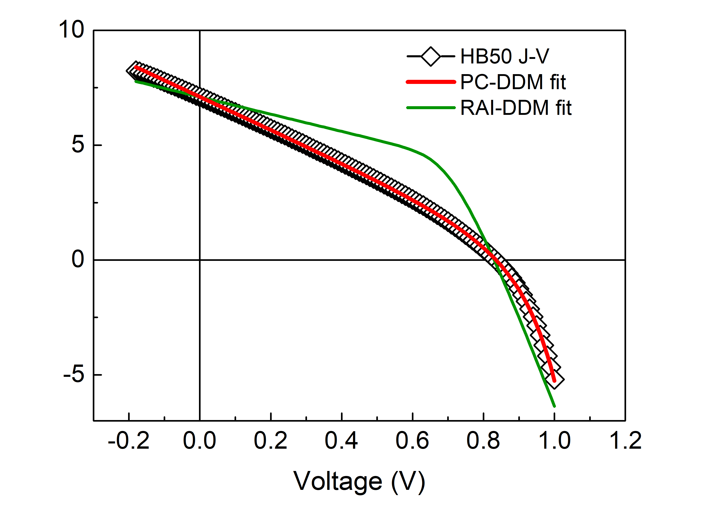

# PC-DDM: Physically Constrained Double-Diode Modeling for OPV Devices

This repository contains a Python implementation of the **Physically Constrained Double-Diode Model (PC-DDM)** for the analysis of current–voltage (J–V) characteristics of organic photovoltaic (OPV) devices.

The code is designed for **transparent, reproducible, and publication-ready device modeling**, with a clear separation between the RAI-DDM analytical initialization step and the PC-DDM constrained nonlinear refinement step.

---

## Methodology

### Step 1: RAI-DDM Initialization
An initial parameter set is obtained using the **RAI-DDM scheme** — a recursive analytical initialization based on Şentürk's formulation, using measurable keypoints (J_sc, V_oc, V_mp, J_mp) to generate physically bounded starting estimates.

### Step 2: PC-DDM Constrained Refinement
All parameters except n₁ are refined simultaneously using **physically constrained nonlinear least-squares optimization** under explicit physical bounds.

**Key methodological choices:**

| Choice | Value | Rationale |
|--------|-------|-----------|
| n₁ (diffusion-diode ideality) | **Fixed = 1.0** | When n₁ is free, pronounced parameter compensation occurs. Robustness test: 4/5 devices converge to n₁=1.0 when allowed to vary in [1.0, 1.8]. |
| n₂ upper bound | **10.0** | Identifiability analysis confirmed a stable interior minimum at n₂ ≈ 8.2–8.3; bound of 10.0 is non-constraining. |
| Residual weighting | **Post-V_oc region** | w(V) = 1 + 4·clip((V − 0.7·V_oc)/(V_max − 0.7·V_oc), 0, 1) — emphasizes the high-voltage regime where Rs, n₂, J₀₂ are most identifiable. |
| Multi-start | **50 starts** | Ensures convergence to global minimum. |

---

## Features

- Reads simple two-column `.dat` files containing voltage (V) and current density (J, mA/cm²)
- Extracts key photovoltaic points:
  - Short-circuit current density (J_sc)
  - Open-circuit voltage (V_oc)
  - Maximum power point (J_mp, V_mp)
- Computes RAI-DDM initial parameter set using Şentürk's recursive analytical scheme
- Performs PC-DDM physically constrained nonlinear least-squares refinement
- Optimized parameters: J_L, J₀₁, J₀₂, Rs, Rsh, n₂ (n₁ fixed to 1.0)
- Multi-start optimization with 50 random initializations
- Outputs all fitted parameters to console
- Generates publication-quality J–V comparison plot

---

## What This Code Does Not Do

❌ No Excel (.xlsx) output  
❌ No device area input  
❌ No Keithley-specific `.txt` or `.csv` parsing  
❌ No hidden preprocessing or black-box fitting  

This design choice ensures full transparency and reproducibility.

---

## Input File Format

Plain text `.dat` file, two columns (space or tab separated):

```
-0.20    -9.53
-0.10    -9.12
 0.00    -8.75
 0.50     3.10
 0.90    -5.20
```

Lines starting with `#` or `%` are ignored.

---

## Model Parameters

| Parameter | Description | Unit |
|-----------|-------------|------|
| J_L | Photogenerated current density | mA/cm² |
| J₀₁ | Saturation current density — diode 1 (n₁=1, diffusion) | mA/cm² |
| J₀₂ | Saturation current density — diode 2 (n₂, recombination) | mA/cm² |
| Rs | Series resistance | Ω·cm² |
| Rsh | Shunt resistance | Ω·cm² |
| n₁ | Diffusion-diode ideality factor | — (fixed = 1.0) |
| n₂ | Recombination-diode ideality factor | — (optimized, ≤ 10.0) |

**Note on J₀₁:** Once n₁ is fixed and transport/recombination losses are captured primarily through Rs, n₂, and J₀₂, J₀₁ becomes weakly identifiable. It is retained in the model for completeness but should not be interpreted as a precisely determined physical quantity.

---

## Usage

```bash
python Pc_ddm_opv_github_ready.py
```

- Select a `.dat` file when prompted
- Fitted parameters are printed to the terminal
- A J–V plot comparing measured data, RAI-DDM initialization, and PC-DDM fit is displayed

---

## Example Output

The figure below shows a representative PC-DDM fit for an HB50:PCBM device.



**Legend:**
- Open symbols: Measured J–V data (HB50:PCBM)
- Red line: PC-DDM fit (physically constrained, n₁=1 fixed)
- Green line: RAI-DDM fit (Şentürk initialization only, no refinement)

The comparison illustrates how the PC-DDM constrained refinement corrects the systematic deviations left by the RAI-DDM fit, particularly in the post-V_oc high-voltage region where transport-related losses and non-ideal recombination effects dominate.

---
## Repository Contents

- `Pc_ddm_opv_github_ready.py` → Main PC-DDM fitting code
- `requirements.txt` → Required Python packages
- `50 1-4.dat` → Example HB50:PCBM (1:4) J–V dataset
- `75 1-4.dat` → Example HB75:PCBM (1:4) J–V dataset
- `jv_fit_example.png` → Example fitting result

---
## Example Data

Two representative OPV J–V datasets are included for demonstration and reproducibility purposes.

| File | Device |
|--------|--------|
| 50 1-4.dat | HB50:PCBM (1:4) |
| 75 1-4.dat | HB75:PCBM (1:4) |

These files can be directly loaded into the PC-DDM code to reproduce the fitting workflow described in the companion manuscript.

---

## Intended Use

This code is intended for:
- Research on organic solar cells (OPVs)
- Device physics analysis and parameter extraction
- Methodological studies on double-diode model fitting
- Supporting Information (SI) and reproducible research workflows

---

## Author

**Koray Kara**  
Physics / Device Modeling  
Organic Photovoltaics  
İzmir Katip Çelebi University , Graphene Research and Application Center - İzmir / TURKEY

Helmholtz Zentrum Berlin , HySprint - Berlin / GERMANY

---

## How to Cite

If you use this code in academic work, please cite the companion paper:

> K. Kara, *Physically Constrained Double-Diode Modeling of Organic Solar Cells: Linking OFET Charge-Transport Fingerprints to Photovoltaic Loss Mechanisms*, Solar Energy Materials and Solar Cells (submitted, 2026).

---

## License

This project is provided for research and educational purposes. Please cite appropriately if used in academic work.
