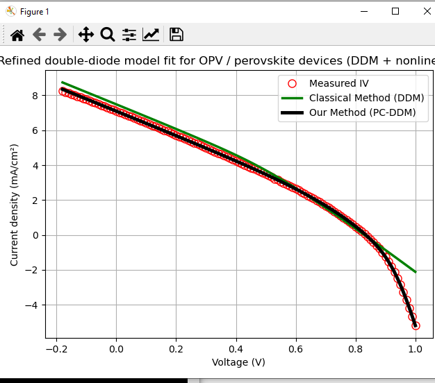

# PC-DDM: Physically Constrained Double-Diode Modeling for OPV / Perovskite Devices

This repository contains a Python implementation of a **physically constrained double-diode model (PC-DDM)** for the analysis of current–voltage (J–V) characteristics of organic and perovskite solar cells.

The code is designed for **transparent, reproducible, and publication-ready device modeling**, with a clear separation between classical analytical initialization and nonlinear parameter refinement.

---

## Features

- Reads **simple two-column `.dat` files** containing voltage (V) and current density (J).
- Extracts key photovoltaic points:
  - Short-circuit current (Isc)
  - Open-circuit voltage (Voc)
  - Maximum power point (Imp, Vmp)
- Computes an **initial parameter set** using a classical analytical double-diode method.
- Performs **physically constrained nonlinear least-squares refinement (PC-DDM)**.
- Simultaneously optimizes all double-diode parameters:
  - IL, I01, I02, Rs, Rsh, n1, n2
- Compares:
  - Measured J–V data
  - Classical DDM initialization
  - Refined PC-DDM result
- Outputs all fitted parameters **to the console only**.
- Generates **publication-quality J–V plots**.

---

## What This Code Does *Not* Do

- ❌ No Excel (`.xlsx`) output
- ❌ No device area input
- ❌ No Keithley-specific `.txt` or `.csv` parsing
- ❌ No hidden preprocessing or black-box fitting

This design choice ensures **full transparency and reproducibility**.

---

## Input File Format

The code expects a plain text `.dat` file with **two columns**:

Voltage(V) CurrentDensity(mA/cm^2)

Example:

Voltage(V) CurrentDensity(mA/cm^2)

-0.20 -9.53
-0.10 -9.12
0.00 -8.75
0.50 3.10
0.90 -5.20


- Columns may be separated by spaces or tabs.
- Lines starting with `#` or `%` are ignored.

---

## Model Parameters

The physically constrained double-diode model includes:

| Parameter | Description |
|---------|-------------|
| IL  | Photogenerated current density (mA/cm²) |
| I01 | Saturation current density of diode 1 (mA/cm²) |
| I02 | Saturation current density of diode 2 (mA/cm²) |
| Rs  | Series resistance (Ω·cm²) |
| Rsh | Shunt resistance (Ω·cm²) |
| n1  | Ideality factor of diode 1 |
| n2  | Ideality factor of diode 2 |

---

## Methodology Overview

1. **Classical DDM Initialization**  
   An analytical double-diode formulation is used to obtain a physically meaningful initial parameter set.

2. **Physically Constrained Refinement (PC-DDM)**  
   All parameters are refined simultaneously using nonlinear least-squares optimization under explicit physical bounds.

3. **Weighted Residuals**  
   Additional emphasis is placed on the J–V knee region to ensure accurate reproduction of the full curve shape.

---

## Usage

Run the script directly:

```bash
python Pc_ddm_opv_github_ready.py

 Select a .dat file when prompted.

 Fitted parameters are printed to the terminal.

 A J–V plot comparing measured data, classical DDM, and PC-DDM is displayed.

##Intended Use

This code is intended for:

Research on organic solar cells (OPVs) and perovskite solar cells

Device physics analysis and parameter extraction

Methodological studies on diode-model fitting

Supporting information (SI) and reproducible research workflows

##Author

Koray Kara
Physics / Device Modeling
Organic & Perovskite Photovoltaics

##License

This project is provided for research and educational purposes.
Please cite appropriately if used in academic work.

## Example J–V Fit



*Measured J–V data (red), classical double-diode model (green),
and refined PC-DDM fit (black).*


